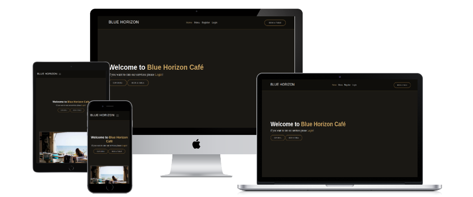
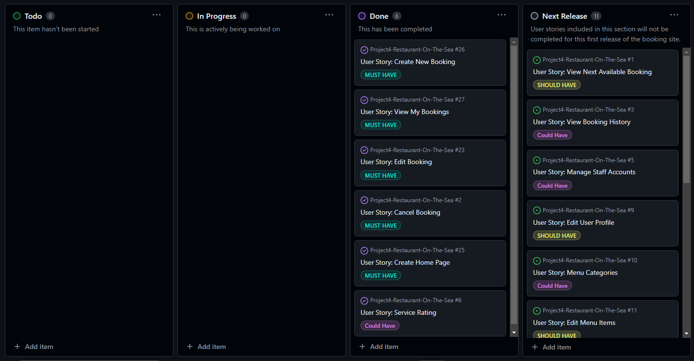
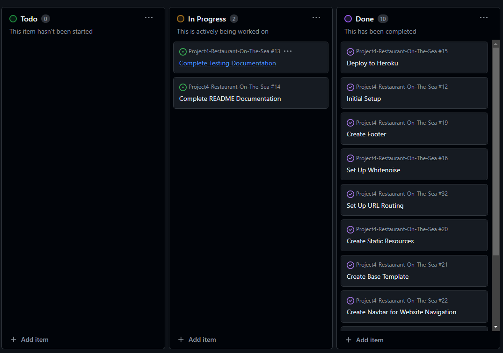

# Restaurant Blue Horizon
Blue Horizon Café is a fictional seaside restaurant offering a charming dining experience. This Django app provides a robust booking system for users to reserve tables and manage their bookings. Additionally, it features a review system for customers to rate and share feedback on their dining experience. The application ensures a user-friendly interface for both customers and staff to handle reservations and reviews efficiently.

The live link can be found here: [Live Site ](https://project4-restaurant-booking-cacc3b345e08.herokuapp.com/)



## Table of Contents


# User-Experience-Design

## The-Strategy-Plane

### Site-Goals

The site is designed to assist restaurant staff in efficiently tracking upcoming bookings and managing capacity, allowing for easy editing and deletion as necessary.

Additionally, the site aims to offer customers a simple, hassle-free way to make reservations without the need to call the restaurant. Customers will also be able to cancel or update their bookings as needed. Furthermore, the site provides an option for customers to review the restaurant's services, enabling valuable feedback that can help improve the overall dining experience.


### Agile Planning

This project followed agile methodologies, delivering features in three evenly spaced sprints over four weeks.

Tasks were organized into user stories and prioritized as "Must have," "Should have," and "Could have." These were assigned to sprints and evaluated for complexity. Priority was given to "Must have" stories to ensure core requirements were met, followed by "Should have" and "Could have" stories if time permitted.

I created two Kanban boards using GitHub Projects: one for user stories and another specifically for tasks the developer needs to complete. These boards provide detailed information on project cards. All user stories, except documentation tasks, include acceptance criteria to clearly define completion requirements.

Thye can be located here: 

- [User Stories](https://github.com/users/Cosmin1907/projects/4)

- [Developer Board](https://github.com/users/Cosmin1907/projects/6/views/1)





#### Milestones

The project had 8 main milestones:

**Milestone 1 - Base Setup**

The base setup milestone covered all tasks needed for the initial setup of the application. As the foundation for the entire project, it was the first to be completed since all other features depended on it.

**Milestone 2 - Standalone Pages**

This milestone included small pages that didn't have enough tasks to warrant their own milestones. Instead of creating separate milestones for these minor features, they were grouped together under this one.

**Milestone 3 - Authentication**

This milestone focused on tasks related to registration, login, and authorization. It was crucial for securing the application, ensuring that only staff could manage bookings while regular users had restricted access.

**Milestone 4 - Booking**

This milestone included all tasks related to creating, viewing, updating, and deleting bookings. It allowed staff to manage upcoming bookings and customers to book and manage their own reservations.

**Milestone 5 - Deployment**

This milestone covered all tasks necessary for deploying the app to Heroku, ensuring the site was live for both staff and customer use.

**Milestone 6 - Review System**

The review system milestone was a last-minute addition based on the remaining development time. It involves implementing a system that allows users to provide feedback on the restaurant's services, aiming to gather customer reviews and ratings to improve service quality and user experience.

**Milestone 7 - Unit Testing**

The unit testing milestone includes the creation of unit tests to verify core functionality. These tests cover essential aspects such as template usage, redirects, form functionality, programming logic, and page display to ensure that the application performs as expected.

**Milestone 8 - Documentation**

This milestone was dedicated to documenting the software development lifecycle of the application. It aimed to provide comprehensive documentation, detailing all stages of development and necessary information for running, deploying, and using the application.


## The-Scope-Plane


## The-Structure-Plane

### Features

Navbar Description
The navbar provides a responsive navigation solution for users to access various sections of the website, ensuring an optimal experience across different devices. Here’s a detailed description of its features:

Navigation Toggle Button:

A navbar-toggler button is visible on smaller screens. It allows users to toggle the visibility of the navigation menu.
The button is styled with a custom appearance and uses Bootstrap’s built-in functionality for collapsing the navbar on mobile devices.
Navbar Links:

Home: Always visible to all users. 
Menu: Always visible to all users. Highlights as the active link when the user is on the menu page.
Bookings: Shown only to logged-in users. Highlights as the active link when the user is on the bookings page.
The navbar uses authentication-based visibility for links: Register and Login are shown to non-logged-in users, while Logout is visible to logged-in users. The active link is highlighted based on the current page.
The links highlight as the active links when the user is on the page

Additional Link:

Book a Table: Provides a link to a form where users can book a table. This link is styled separately and is accessible for users on larger screens.


Implementation:

**Navigation Menu**


Implementation:

**Home Page**


Implementation:

**Footer**


Implementation:

**Menu Page**


Implementation:


**Create booking page**


Implementation:

**Manage bookings page**


Implementation:

**Edit Booking Page**


Implementation:

**Toasts**

Custom toasts were implemented on the successful creation and editing of bookings. This will provide feedback to the user to relay information that the booking was successfully received or updated.


``text here``

Implementation:

**Delete Booking Page**


Favicon


**Error Pages**


Implementation:

**403 Page**

### Features Left To Implement


## The-Skeleton-Plane

### Wireframes

- Home page


- Signup page


- Log in


- Log Out


- Create Booking


- Edit Booking 


- Manage Bookings


- Delete Booking 


- 403 Error 


### Database-Design

Entity relationship diagram was created using []() 


### Security


## The-Surface-Plane
### Design

### Colour-Scheme


### Typography


### Imagery


## Technolgies

- HTML
  - The structure of the Website was developed using HTML as the main language.
- CSS
  - The Website was styled using custom CSS in an external file.
- JavaScript
  - JavaScript was used to make the custom slider on the menu page change and the bootstrap date picker.
- Python
  - Python was the main programming language used for the application using the Django Framework.
- Visual Studio Code
  - The website was developed using Visual Studio Code IDE
- GitHub
  - Source code is hosted on GitHub
- Git
  - Used to commit and push code during the development of the Website
- Font Awesome
  - This was used for various icons throughout the site
- Favicon.io
  - favicon files were created at https://favicon.io/favicon-converter/
- balsamiq
  - wireframes were created using balsamiq 
- TinyPNG
  - This was used to compress the hero image for optimal load times

**Python Modules Used**

**External Python Modules**

* 

## Testing

Test cases and results can be found in the [TESTING.md](TESTING.md) file. 

## Deployment

### Version Control

The site was created using the Visual Studio Code editor and pushed to github to the remote repository ‘Gars-Steakhouse’.

The following git commands were used throughout development to push code to the remote repo:

```git add <file>``` - This command was used to add the file(s) to the staging area before they are committed.

```git commit -m “commit message”``` - This command was used to commit changes to the local repository queue ready for the final step.

```git push``` - This command was used to push all committed code to the remote repository on github.

### Heroku Deployment

The site was deployed to Heroku. The steps to deploy are as follows:

- Navigate to heroku and create an account
- Click the new button in the top right corner
- Select create new app
- Enter app name
- Select region and click create app
- Click the resources tab and search for Heroku Postgres
- Select hobby dev and continue
- Go to the settings tab and then click reveal config vars
- Add the following config vars:
  - SECRET_KEY: (Your secret key)
  - DATABASE_URL: (This should already exist with add on of postgres)
  - EMAIL_HOST_USER: (email address)
  - EMAIL_HOST_PASS: (email app password)
- Click the deploy tab
- Scroll down to Connect to GitHub and sign in / authorize when prompted
- In the search box, find the repositoy you want to deploy and click connect
- Scroll down to Manual deploy and choose the main branch
- Click deploy

The app should now be deployed.

The live link can be found here: [Live Site]()

### Run Locally

Navigate to the GitHub Repository you want to clone to use locally:

- Click on the code drop down button
- Click on HTTPS
- Copy the repository link to the clipboard
- Open your IDE of choice (git must be installed for the next steps)
- Type git clone copied-git-url into the IDE terminal

The project will now have been cloned on your local machine for use.

### Fork Project

Most commonly, forks are used to either propose changes to someone else's project or to use someone else's project as a starting point for your own idea.

- Navigate to the GitHub Repository you want to fork.

- On the top right of the page under the header, click the fork button.

- This will create a duplicate of the full project in your GitHub Repository.

## Credits 

## Sources

- [Implementing Star Rating in Django](https://medium.com/geekculture/django-implementing-star-rating-e1deff03bb1c)
- [Python `datetime` Documentation](https://docs.python.org/3/library/datetime.html#strftime-and-strptime-behavior)
- [Django Forms Validation](https://docs.djangoproject.com/en/5.0/ref/forms/validation/#cleaning-and-validating-fields-that-depend-on-each-other)
- [Django Forms Tutorial](https://developer.mozilla.org/en-US/docs/Learn/Server-side/Django/Forms)
- [Django ModelForm `save` Method](https://docs.djangoproject.com/en/5.0/topics/forms/modelforms/#the-save-method)
- [Django Messages Framework Tips](https://simpleisbetterthancomplex.com/tips/2016/09/06/django-tip-14-messages-framework.html)
- [Django DeleteView Documentation](https://docs.djangoproject.com/en/4.2/ref/class-based-views/generic-editing/#deleteview)
- [Django Template Tags and Filters - Yesno](https://www.djangotemplatetagsandfilters.com/filters/yesno/)
- [Django UpdateView Documentation](https://docs.djangoproject.com/en/4.2/ref/class-based-views/generic-editing/#updateview)
- [Django Forms Widgets Documentation](https://docs.djangoproject.com/en/4.2/ref/forms/widgets/)
- [Adding Extra Context in Django CBVs](https://docs.djangoproject.com/en/5.0/topics/class-based-views/generic-display/#adding-extra-context)
- [Class-Based Views Overview](https://docs.djangoproject.com/en/5.0/topics/class-based-views/)
- [Django CBVs Generic Editing](https://docs.djangoproject.com/en/3.2/topics/class-based-views/generic-editing/#using-generic-views)
- [Django RegexValidator Documentation](https://docs.djangoproject.com/en/5.0/ref/validators/#django.core.validators.RegexValidator)
- [Django Mobile Number Regular Expression](https://stackoverflow.com/questions/47939753/django-mobile-number-regular-expression)


